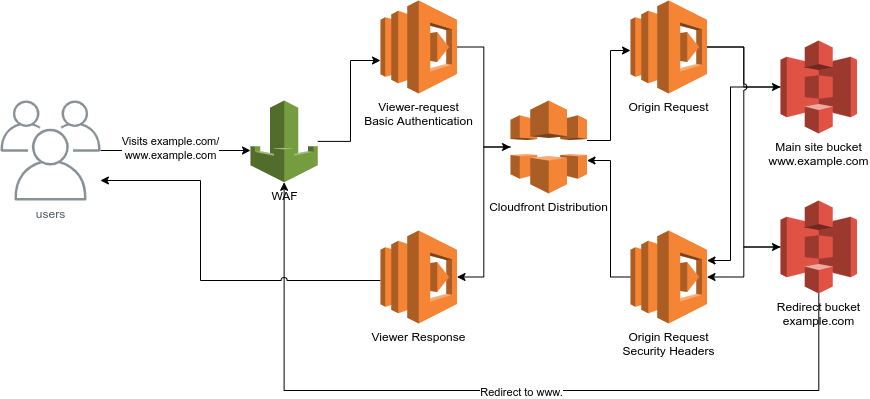

# s3-cloudfront-website

Creates a cloudfront distribution website using s3 bucket website configuration for static file hosting.

## Diagram



## Upgrade notes

### v1.x.x to v2.x.x upgrade

Take note of the breaking changes from [AWS v4 upgrade guid e](https://registry.terraform.io/providers/hashicorp/aws/latest/docs/guides/version-4-upgrade#s3-bucket-refactor)

You will have to run terraform import, e.g replace var.domain_name[0] with your host name `terraform import aws_s3_bucket_logging var.domain_name[0]` for each of the following.
- `aws_s3_bucket_acl`
- `aws_s3_bucket_logging`
- `aws_s3_bucket_policy`
- `aws_s3_bucket_server_side_encryption_configuration`
- `aws_s3_bucket_versioning`
- `aws_s3_bucket_website_configuration`

### v3.x.x to v5.x.x upgrade

In order to remove the lambda redirection and fully rely on cloudfront and s3 to handle it, there needs to be a point the local provider is available during deletion, therefore you need to upgrade to v4.0.0 that removes the lambda successfully, before upgrading to v5.x.x that will handle redirects without lambda

## Adding CSP headers

### Basic CSP Configuration

X headers are returned by default, to customise the content security policy, format it in terraform and provide the full string to the variable `content_security_policy`

### Experimental: CSP with Nonce Support

This module includes an experimental feature to inject nonces into your Content Security Policy and HTML content. This is useful when you need to use inline scripts or styles while maintaining a strict CSP. To enable this feature:

1. Set `enable_nonce = true` in your module configuration
2. Ensure your CSP includes the placeholders `'nonce-%%{SCRIPT_NONCE}%%'` and `'nonce-%%{STYLE_NONCE}%%'` where needed

**Important Limitations:**
- This feature is experimental and should only be enabled if you specifically need nonce support in your CSP
- Nonces cannot be automatically injected into dynamically loaded content (e.g., JavaScript-injected scripts or styles)
- The feature uses Lambda@Edge which may add latency to your requests
- Only works with HTML files and requires proper Content-Type headers

```
locals {
  default-src = join(" ", ["default-src", "'none'"])
  connect-src = join(" ", ["connect-src", "https://*.example.com"])
  font-src = join(" ", ["font-src", "'self'"])
  img-src = join(" ", ["img-src", "'self'"])
  script-src = join(" ", ["script-src", "'self'"])
  style-src = join(" ", ["style-src", "'self'", "'unsafe-inline'"])
  object-src = join(" ", ["object-src", "'none'"])

  content_security_policy = join( "; ", [local.default-src, local.connect-src, local.font-src, local.img-src, local.script-src, local.style-src, local.object-src])
}

module "cloudfront" {
  ...
  content_security_policy = local.content_security_policy
  ...
}
```

## Requirements

| Name | Version |
|------|---------|
| <a name="requirement_local"></a> [local](#requirement\_local) | ~> 2.1 |

## Providers

| Name | Version |
|------|---------|
| <a name="provider_aws"></a> [aws](#provider\_aws) | n/a |
| <a name="provider_aws.us-east-1"></a> [aws.us-east-1](#provider\_aws.us-east-1) | n/a |

## Modules

No modules.

## Resources

| Name | Type |
|------|------|
| [aws_acm_certificate.cert](https://registry.terraform.io/providers/hashicorp/aws/latest/docs/resources/acm_certificate) | resource |
| [aws_acm_certificate_validation.cert](https://registry.terraform.io/providers/hashicorp/aws/latest/docs/resources/acm_certificate_validation) | resource |
| [aws_cloudfront_distribution.web_dist](https://registry.terraform.io/providers/hashicorp/aws/latest/docs/resources/cloudfront_distribution) | resource |
| [aws_cloudfront_distribution.web_redirect](https://registry.terraform.io/providers/hashicorp/aws/latest/docs/resources/cloudfront_distribution) | resource |
| [aws_cloudfront_origin_access_control.main](https://registry.terraform.io/providers/hashicorp/aws/latest/docs/resources/cloudfront_origin_access_control) | resource |
| [aws_cloudfront_origin_access_identity.origin_access_identity](https://registry.terraform.io/providers/hashicorp/aws/latest/docs/resources/cloudfront_origin_access_identity) | resource |
| [aws_cloudfront_response_headers_policy.web_dist](https://registry.terraform.io/providers/hashicorp/aws/latest/docs/resources/cloudfront_response_headers_policy) | resource |
| [aws_route53_record.cert_validation](https://registry.terraform.io/providers/hashicorp/aws/latest/docs/resources/route53_record) | resource |
| [aws_route53_record.redirect](https://registry.terraform.io/providers/hashicorp/aws/latest/docs/resources/route53_record) | resource |
| [aws_route53_record.www](https://registry.terraform.io/providers/hashicorp/aws/latest/docs/resources/route53_record) | resource |
| [aws_s3_bucket.main](https://registry.terraform.io/providers/hashicorp/aws/latest/docs/resources/s3_bucket) | resource |
| [aws_s3_bucket.redirect](https://registry.terraform.io/providers/hashicorp/aws/latest/docs/resources/s3_bucket) | resource |
| [aws_s3_bucket_acl.redirect](https://registry.terraform.io/providers/hashicorp/aws/latest/docs/resources/s3_bucket_acl) | resource |
| [aws_s3_bucket_logging.main](https://registry.terraform.io/providers/hashicorp/aws/latest/docs/resources/s3_bucket_logging) | resource |
| [aws_s3_bucket_logging.redirect](https://registry.terraform.io/providers/hashicorp/aws/latest/docs/resources/s3_bucket_logging) | resource |
| [aws_s3_bucket_policy.main](https://registry.terraform.io/providers/hashicorp/aws/latest/docs/resources/s3_bucket_policy) | resource |
| [aws_s3_bucket_policy.redirect](https://registry.terraform.io/providers/hashicorp/aws/latest/docs/resources/s3_bucket_policy) | resource |
| [aws_s3_bucket_public_access_block.public_access_block_main](https://registry.terraform.io/providers/hashicorp/aws/latest/docs/resources/s3_bucket_public_access_block) | resource |
| [aws_s3_bucket_public_access_block.public_access_block_redirect](https://registry.terraform.io/providers/hashicorp/aws/latest/docs/resources/s3_bucket_public_access_block) | resource |
| [aws_s3_bucket_server_side_encryption_configuration.main](https://registry.terraform.io/providers/hashicorp/aws/latest/docs/resources/s3_bucket_server_side_encryption_configuration) | resource |
| [aws_s3_bucket_server_side_encryption_configuration.redirect](https://registry.terraform.io/providers/hashicorp/aws/latest/docs/resources/s3_bucket_server_side_encryption_configuration) | resource |
| [aws_s3_bucket_versioning.main](https://registry.terraform.io/providers/hashicorp/aws/latest/docs/resources/s3_bucket_versioning) | resource |
| [aws_s3_bucket_versioning.redirect](https://registry.terraform.io/providers/hashicorp/aws/latest/docs/resources/s3_bucket_versioning) | resource |
| [aws_s3_bucket_website_configuration.main](https://registry.terraform.io/providers/hashicorp/aws/latest/docs/resources/s3_bucket_website_configuration) | resource |
| [aws_s3_bucket_website_configuration.redirect](https://registry.terraform.io/providers/hashicorp/aws/latest/docs/resources/s3_bucket_website_configuration) | resource |
| [aws_caller_identity.current](https://registry.terraform.io/providers/hashicorp/aws/latest/docs/data-sources/caller_identity) | data source |
| [aws_iam_policy_document.bucket_policy](https://registry.terraform.io/providers/hashicorp/aws/latest/docs/data-sources/iam_policy_document) | data source |
| [aws_iam_policy_document.bucket_policy_redirect](https://registry.terraform.io/providers/hashicorp/aws/latest/docs/data-sources/iam_policy_document) | data source |

## Inputs

| Name | Description | Type | Default | Required |
|------|-------------|------|---------|:--------:|
| <a name="input_cloudfront_origin_path"></a> [cloudfront\_origin\_path](#input\_cloudfront\_origin\_path) | Origin path of CloudFront | `string` | `""` | no |
| <a name="input_content_security_policy"></a> [content\_security\_policy](#input\_content\_security\_policy) | Formatted CSP in string | `string` | `"default-src 'none';"` | no |
| <a name="input_enable_nonce"></a> [enable\_nonce](#input\_enable\_nonce) | Enable experimental nonce injection for Content Security Policy | `bool` | `false` | no |
| <a name="input_cors_allowed_origins"></a> [cors\_allowed\_origins](#input\_cors\_allowed\_origins) | CORS allowed origins | `list(string)` | `[]` | no |
| <a name="input_domain_names"></a> [domain\_names](#input\_domain\_names) | domain names to serve site on | `list(string)` | n/a | yes |
| <a name="input_enable_acm_validation"></a> [enable\_acm\_validation](#input\_enable\_acm\_validation) | Validates ACM by updating route 53 DNS | `bool` | `false` | no |
| <a name="input_enable_compression"></a> [enable\_compression](#input\_enable\_compression) | Toggle whether the default cache behaviour has compression enabled | `bool` | `true` | no |
| <a name="input_forward_query_string"></a> [forward\_query\_string](#input\_forward\_query\_string) | forward query strings to origin | `bool` | `false` | no |
| <a name="input_lambda_function_associations"></a> [lambda\_function\_associations](#input\_lambda\_function\_associations) | CloudFront Lambda function associations. key is CloudFront event type and value is lambda function ARN with version | `map(string)` | `{}` | no |
| <a name="input_main_default_ttl"></a> [main\_default\_ttl](#input\_main\_default\_ttl) | default TTL of the main cloudfront distribution | `number` | `180` | no |
| <a name="input_ordered_cache_behaviors"></a> [ordered\_cache\_behaviors](#input\_ordered\_cache\_behaviors) | n/a | <pre>list(object({<br>    path                  = string<br>    function-associations = map(string)<br>  }))</pre> | `[]` | no |
| <a name="input_permissions_boundary"></a> [permissions\_boundary](#input\_permissions\_boundary) | If provided, all IAM roles will be created with this permissions boundary attached. | `string` | `""` | no |
| <a name="input_redirect_domain_names"></a> [redirect\_domain\_names](#input\_redirect\_domain\_names) | domain names to redirect to `domain_names` | `list(string)` | n/a | yes |
| <a name="input_route53_zone_id"></a> [route53\_zone\_id](#input\_route53\_zone\_id) | Route53 Zone ID | `string` | `""` | no |
| <a name="input_s3_logging_bucket"></a> [s3\_logging\_bucket](#input\_s3\_logging\_bucket) | Bucket which will store s3 access logs | `string` | `""` | no |
| <a name="input_s3_logging_bucket_prefix"></a> [s3\_logging\_bucket\_prefix](#input\_s3\_logging\_bucket\_prefix) | Bucket which will store s3 access logs | `string` | `""` | no |
| <a name="input_save_access_log"></a> [save\_access\_log](#input\_save\_access\_log) | whether save cloudfront access log to S3 | `bool` | `false` | no |
| <a name="input_service_name"></a> [service\_name](#input\_service\_name) | tagged with service name | `any` | n/a | yes |
| <a name="input_web_acl_id"></a> [web\_acl\_id](#input\_web\_acl\_id) | WAF ACL to attach to the cloudfront distribution | `string` | `""` | no |

## Outputs

| Name | Description |
|------|-------------|
| <a name="output_acm_arn"></a> [acm\_arn](#output\_acm\_arn) | ARN of acm certificate |
| <a name="output_aws_cloudfront_response_headers_policy_cors_config"></a> [aws\_cloudfront\_response\_headers\_policy\_cors\_config](#output\_aws\_cloudfront\_response\_headers\_policy\_cors\_config) | n/a |
| <a name="output_aws_cloudfront_response_headers_policy_custom_headers_config"></a> [aws\_cloudfront\_response\_headers\_policy\_custom\_headers\_config](#output\_aws\_cloudfront\_response\_headers\_policy\_custom\_headers\_config) | n/a |
| <a name="output_aws_cloudfront_response_headers_policy_security_headers_config"></a> [aws\_cloudfront\_response\_headers\_policy\_security\_headers\_config](#output\_aws\_cloudfront\_response\_headers\_policy\_security\_headers\_config) | n/a |
| <a name="output_cache_invalidation_command"></a> [cache\_invalidation\_command](#output\_cache\_invalidation\_command) | CloudFront edge cache invalidation command. /path/to/invalidation/resource is like /index.html /error.html |
| <a name="output_cache_invalidation_redirect_command"></a> [cache\_invalidation\_redirect\_command](#output\_cache\_invalidation\_redirect\_command) | CloudFront edge cache invalidation command. /path/to/invalidation/resource is like /index.html /error.html |
| <a name="output_cloudfront_distribution_main_arn"></a> [cloudfront\_distribution\_main\_arn](#output\_cloudfront\_distribution\_main\_arn) | ARN of cloudfront distribution |
| <a name="output_cloudfront_distribution_main_domain_name"></a> [cloudfront\_distribution\_main\_domain\_name](#output\_cloudfront\_distribution\_main\_domain\_name) | Domain URL of cloudfront distribution |
| <a name="output_cloudfront_distribution_main_etag"></a> [cloudfront\_distribution\_main\_etag](#output\_cloudfront\_distribution\_main\_etag) | ETag of cloudfront distribution |
| <a name="output_cloudfront_distribution_main_hosted_zone_id"></a> [cloudfront\_distribution\_main\_hosted\_zone\_id](#output\_cloudfront\_distribution\_main\_hosted\_zone\_id) | hosted zone id of cloudfront distribution |
| <a name="output_cloudfront_distribution_redirect_arn"></a> [cloudfront\_distribution\_redirect\_arn](#output\_cloudfront\_distribution\_redirect\_arn) | ARN of cloudfront distribution |
| <a name="output_cloudfront_distribution_redirect_domain_name"></a> [cloudfront\_distribution\_redirect\_domain\_name](#output\_cloudfront\_distribution\_redirect\_domain\_name) | Domain URL of cloudfront distribution |
| <a name="output_cloudfront_distribution_redirect_etag"></a> [cloudfront\_distribution\_redirect\_etag](#output\_cloudfront\_distribution\_redirect\_etag) | ETag of cloudfront distribution |
| <a name="output_cloudfront_distribution_redirect_hosted_zone_id"></a> [cloudfront\_distribution\_redirect\_hosted\_zone\_id](#output\_cloudfront\_distribution\_redirect\_hosted\_zone\_id) | hosted zone id of cloudfront distribution |
| <a name="output_s3_main_arn"></a> [s3\_main\_arn](#output\_s3\_main\_arn) | ARN of s3 hosting index.html of site |
| <a name="output_s3_main_website_domain"></a> [s3\_main\_website\_domain](#output\_s3\_main\_website\_domain) | n/a |
| <a name="output_s3_main_website_endpoint"></a> [s3\_main\_website\_endpoint](#output\_s3\_main\_website\_endpoint) | n/a |
| <a name="output_s3_redirec_website_endpoint"></a> [s3\_redirec\_website\_endpoint](#output\_s3\_redirec\_website\_endpoint) | n/a |
| <a name="output_s3_redirect_arn"></a> [s3\_redirect\_arn](#output\_s3\_redirect\_arn) | ARN of s3 hosting redirection to www. |
| <a name="output_s3_redirect_website_domain"></a> [s3\_redirect\_website\_domain](#output\_s3\_redirect\_website\_domain) | n/a |
## Requirements

| Name | Version |
|------|---------|
| <a name="requirement_local"></a> [local](#requirement\_local) | ~> 2.1 |

## Providers

| Name | Version |
|------|---------|
| <a name="provider_archive"></a> [archive](#provider\_archive) | n/a |
| <a name="provider_aws"></a> [aws](#provider\_aws) | n/a |
| <a name="provider_aws.us-east-1"></a> [aws.us-east-1](#provider\_aws.us-east-1) | n/a |
| <a name="provider_null"></a> [null](#provider\_null) | n/a |

## Modules

No modules.

## Resources

| Name | Type |
|------|------|
| [aws_acm_certificate.cert](https://registry.terraform.io/providers/hashicorp/aws/latest/docs/resources/acm_certificate) | resource |
| [aws_acm_certificate_validation.cert](https://registry.terraform.io/providers/hashicorp/aws/latest/docs/resources/acm_certificate_validation) | resource |
| [aws_cloudfront_distribution.web_dist](https://registry.terraform.io/providers/hashicorp/aws/latest/docs/resources/cloudfront_distribution) | resource |
| [aws_cloudfront_distribution.web_redirect](https://registry.terraform.io/providers/hashicorp/aws/latest/docs/resources/cloudfront_distribution) | resource |
| [aws_cloudfront_origin_access_control.main](https://registry.terraform.io/providers/hashicorp/aws/latest/docs/resources/cloudfront_origin_access_control) | resource |
| [aws_cloudfront_origin_access_identity.origin_access_identity](https://registry.terraform.io/providers/hashicorp/aws/latest/docs/resources/cloudfront_origin_access_identity) | resource |
| [aws_cloudfront_response_headers_policy.web_dist](https://registry.terraform.io/providers/hashicorp/aws/latest/docs/resources/cloudfront_response_headers_policy) | resource |
| [aws_cloudwatch_log_group.nonce_injector](https://registry.terraform.io/providers/hashicorp/aws/latest/docs/resources/cloudwatch_log_group) | resource |
| [aws_iam_role.lambda_edge](https://registry.terraform.io/providers/hashicorp/aws/latest/docs/resources/iam_role) | resource |
| [aws_iam_role_policy.lambda_edge_s3](https://registry.terraform.io/providers/hashicorp/aws/latest/docs/resources/iam_role_policy) | resource |
| [aws_iam_role_policy_attachment.lambda_edge_basic](https://registry.terraform.io/providers/hashicorp/aws/latest/docs/resources/iam_role_policy_attachment) | resource |
| [aws_lambda_function.nonce_injector](https://registry.terraform.io/providers/hashicorp/aws/latest/docs/resources/lambda_function) | resource |
| [aws_route53_record.cert_validation](https://registry.terraform.io/providers/hashicorp/aws/latest/docs/resources/route53_record) | resource |
| [aws_route53_record.redirect](https://registry.terraform.io/providers/hashicorp/aws/latest/docs/resources/route53_record) | resource |
| [aws_route53_record.www](https://registry.terraform.io/providers/hashicorp/aws/latest/docs/resources/route53_record) | resource |
| [aws_s3_bucket.main](https://registry.terraform.io/providers/hashicorp/aws/latest/docs/resources/s3_bucket) | resource |
| [aws_s3_bucket.redirect](https://registry.terraform.io/providers/hashicorp/aws/latest/docs/resources/s3_bucket) | resource |
| [aws_s3_bucket_logging.main](https://registry.terraform.io/providers/hashicorp/aws/latest/docs/resources/s3_bucket_logging) | resource |
| [aws_s3_bucket_logging.redirect](https://registry.terraform.io/providers/hashicorp/aws/latest/docs/resources/s3_bucket_logging) | resource |
| [aws_s3_bucket_ownership_controls.main](https://registry.terraform.io/providers/hashicorp/aws/latest/docs/resources/s3_bucket_ownership_controls) | resource |
| [aws_s3_bucket_ownership_controls.redirect](https://registry.terraform.io/providers/hashicorp/aws/latest/docs/resources/s3_bucket_ownership_controls) | resource |
| [aws_s3_bucket_policy.main](https://registry.terraform.io/providers/hashicorp/aws/latest/docs/resources/s3_bucket_policy) | resource |
| [aws_s3_bucket_policy.redirect](https://registry.terraform.io/providers/hashicorp/aws/latest/docs/resources/s3_bucket_policy) | resource |
| [aws_s3_bucket_public_access_block.public_access_block_main](https://registry.terraform.io/providers/hashicorp/aws/latest/docs/resources/s3_bucket_public_access_block) | resource |
| [aws_s3_bucket_public_access_block.public_access_block_redirect](https://registry.terraform.io/providers/hashicorp/aws/latest/docs/resources/s3_bucket_public_access_block) | resource |
| [aws_s3_bucket_server_side_encryption_configuration.main](https://registry.terraform.io/providers/hashicorp/aws/latest/docs/resources/s3_bucket_server_side_encryption_configuration) | resource |
| [aws_s3_bucket_server_side_encryption_configuration.redirect](https://registry.terraform.io/providers/hashicorp/aws/latest/docs/resources/s3_bucket_server_side_encryption_configuration) | resource |
| [aws_s3_bucket_versioning.main](https://registry.terraform.io/providers/hashicorp/aws/latest/docs/resources/s3_bucket_versioning) | resource |
| [aws_s3_bucket_versioning.redirect](https://registry.terraform.io/providers/hashicorp/aws/latest/docs/resources/s3_bucket_versioning) | resource |
| [aws_s3_bucket_website_configuration.main](https://registry.terraform.io/providers/hashicorp/aws/latest/docs/resources/s3_bucket_website_configuration) | resource |
| [aws_s3_bucket_website_configuration.redirect](https://registry.terraform.io/providers/hashicorp/aws/latest/docs/resources/s3_bucket_website_configuration) | resource |
| [null_resource.nonce_injector_deps](https://registry.terraform.io/providers/hashicorp/null/latest/docs/resources/resource) | resource |
| [archive_file.nonce_injector](https://registry.terraform.io/providers/hashicorp/archive/latest/docs/data-sources/file) | data source |
| [aws_caller_identity.current](https://registry.terraform.io/providers/hashicorp/aws/latest/docs/data-sources/caller_identity) | data source |
| [aws_iam_policy_document.bucket_policy](https://registry.terraform.io/providers/hashicorp/aws/latest/docs/data-sources/iam_policy_document) | data source |
| [aws_iam_policy_document.bucket_policy_redirect](https://registry.terraform.io/providers/hashicorp/aws/latest/docs/data-sources/iam_policy_document) | data source |

## Inputs

| Name | Description | Type | Default | Required |
|------|-------------|------|---------|:--------:|
| <a name="input_cloudfront_origin_path"></a> [cloudfront\_origin\_path](#input\_cloudfront\_origin\_path) | Origin path of CloudFront | `string` | `""` | no |
| <a name="input_content_security_policy"></a> [content\_security\_policy](#input\_content\_security\_policy) | Default Content Security Policy to use when no custom CSP is provided in request headers | `string` | `"default-src 'none'; img-src 'self'; script-src 'self' 'nonce-%{SCRIPT_NONCE}%%'; style-src 'self' 'nonce-%{STYLE_NONCE}%%'; object-src 'none'"` | no |
| <a name="input_cors_allowed_origins"></a> [cors\_allowed\_origins](#input\_cors\_allowed\_origins) | CORS allowed origins | `list(string)` | `[]` | no |
| <a name="input_domain_names"></a> [domain\_names](#input\_domain\_names) | domain names to serve site on | `list(string)` | n/a | yes |
| <a name="input_enable_acm_validation"></a> [enable\_acm\_validation](#input\_enable\_acm\_validation) | Validates ACM by updating route 53 DNS | `bool` | `false` | no |
| <a name="input_enable_compression"></a> [enable\_compression](#input\_enable\_compression) | Toggle whether the default cache behaviour has compression enabled | `bool` | `true` | no |
| <a name="input_enable_nonce"></a> [enable\_nonce](#input\_enable\_nonce) | Enable nonce injection for Content Security Policy | `bool` | `false` | no |
| <a name="input_forward_query_string"></a> [forward\_query\_string](#input\_forward\_query\_string) | forward query strings to origin | `bool` | `false` | no |
| <a name="input_lambda_function_associations"></a> [lambda\_function\_associations](#input\_lambda\_function\_associations) | CloudFront Lambda function associations. key is CloudFront event type and value is an object with 'arn' (Lambda function ARN with version) and 'include\_body' (whether to include request/response body) fields. For nonce injection, this is automatically populated with the nonce-injector Lambda. | <pre>map(object({<br>    arn = string<br>    include_body = bool<br>  }))</pre> | `{}` | no |
| <a name="input_main_default_ttl"></a> [main\_default\_ttl](#input\_main\_default\_ttl) | default TTL of the main cloudfront distribution | `number` | `180` | no |
| <a name="input_ordered_cache_behaviors"></a> [ordered\_cache\_behaviors](#input\_ordered\_cache\_behaviors) | Ordered cache behaviors with Lambda function associations | <pre>list(object({<br>    path                  = string<br>    lambda_function_associations = map(object({<br>      arn = string<br>      include_body = bool<br>    }))<br>  }))</pre> | `[]` | no |
| <a name="input_permissions_boundary"></a> [permissions\_boundary](#input\_permissions\_boundary) | If provided, all IAM roles will be created with this permissions boundary attached. | `string` | `""` | no |
| <a name="input_redirect_domain_names"></a> [redirect\_domain\_names](#input\_redirect\_domain\_names) | domain names to redirect to `domain_names` | `list(string)` | n/a | yes |
| <a name="input_route53_zone_id"></a> [route53\_zone\_id](#input\_route53\_zone\_id) | Route53 Zone ID | `string` | `""` | no |
| <a name="input_s3_logging_bucket"></a> [s3\_logging\_bucket](#input\_s3\_logging\_bucket) | Bucket which will store s3 access logs | `string` | `""` | no |
| <a name="input_s3_logging_bucket_prefix"></a> [s3\_logging\_bucket\_prefix](#input\_s3\_logging\_bucket\_prefix) | Bucket which will store s3 access logs | `string` | `""` | no |
| <a name="input_save_access_log"></a> [save\_access\_log](#input\_save\_access\_log) | whether save cloudfront access log to S3 | `bool` | `false` | no |
| <a name="input_service_name"></a> [service\_name](#input\_service\_name) | tagged with service name | `any` | n/a | yes |
| <a name="input_web_acl_id"></a> [web\_acl\_id](#input\_web\_acl\_id) | WAF ACL to attach to the cloudfront distribution | `string` | `""` | no |

## Outputs

| Name | Description |
|------|-------------|
| <a name="output_acm_arn"></a> [acm\_arn](#output\_acm\_arn) | ARN of acm certificate |
| <a name="output_aws_cloudfront_response_headers_policy_cors_config"></a> [aws\_cloudfront\_response\_headers\_policy\_cors\_config](#output\_aws\_cloudfront\_response\_headers\_policy\_cors\_config) | n/a |
| <a name="output_aws_cloudfront_response_headers_policy_custom_headers_config"></a> [aws\_cloudfront\_response\_headers\_policy\_custom\_headers\_config](#output\_aws\_cloudfront\_response\_headers\_policy\_custom\_headers\_config) | n/a |
| <a name="output_aws_cloudfront_response_headers_policy_security_headers_config"></a> [aws\_cloudfront\_response\_headers\_policy\_security\_headers\_config](#output\_aws\_cloudfront\_response\_headers\_policy\_security\_headers\_config) | n/a |
| <a name="output_cache_invalidation_command"></a> [cache\_invalidation\_command](#output\_cache\_invalidation\_command) | CloudFront edge cache invalidation command. /path/to/invalidation/resource is like /index.html /error.html |
| <a name="output_cache_invalidation_redirect_command"></a> [cache\_invalidation\_redirect\_command](#output\_cache\_invalidation\_redirect\_command) | CloudFront edge cache invalidation command. /path/to/invalidation/resource is like /index.html /error.html |
| <a name="output_cloudfront_distribution_main_arn"></a> [cloudfront\_distribution\_main\_arn](#output\_cloudfront\_distribution\_main\_arn) | ARN of cloudfront distribution |
| <a name="output_cloudfront_distribution_main_domain_name"></a> [cloudfront\_distribution\_main\_domain\_name](#output\_cloudfront\_distribution\_main\_domain\_name) | Domain URL of cloudfront distribution |
| <a name="output_cloudfront_distribution_main_etag"></a> [cloudfront\_distribution\_main\_etag](#output\_cloudfront\_distribution\_main\_etag) | ETag of cloudfront distribution |
| <a name="output_cloudfront_distribution_main_hosted_zone_id"></a> [cloudfront\_distribution\_main\_hosted\_zone\_id](#output\_cloudfront\_distribution\_main\_hosted\_zone\_id) | hosted zone id of cloudfront distribution |
| <a name="output_cloudfront_distribution_redirect_arn"></a> [cloudfront\_distribution\_redirect\_arn](#output\_cloudfront\_distribution\_redirect\_arn) | ARN of cloudfront distribution |
| <a name="output_cloudfront_distribution_redirect_domain_name"></a> [cloudfront\_distribution\_redirect\_domain\_name](#output\_cloudfront\_distribution\_redirect\_domain\_name) | Domain URL of cloudfront distribution |
| <a name="output_cloudfront_distribution_redirect_etag"></a> [cloudfront\_distribution\_redirect\_etag](#output\_cloudfront\_distribution\_redirect\_etag) | ETag of cloudfront distribution |
| <a name="output_cloudfront_distribution_redirect_hosted_zone_id"></a> [cloudfront\_distribution\_redirect\_hosted\_zone\_id](#output\_cloudfront\_distribution\_redirect\_hosted\_zone\_id) | hosted zone id of cloudfront distribution |
| <a name="output_s3_main_arn"></a> [s3\_main\_arn](#output\_s3\_main\_arn) | ARN of s3 hosting index.html of site |
| <a name="output_s3_main_website_domain"></a> [s3\_main\_website\_domain](#output\_s3\_main\_website\_domain) | n/a |
| <a name="output_s3_main_website_endpoint"></a> [s3\_main\_website\_endpoint](#output\_s3\_main\_website\_endpoint) | n/a |
| <a name="output_s3_redirec_website_endpoint"></a> [s3\_redirec\_website\_endpoint](#output\_s3\_redirec\_website\_endpoint) | n/a |
| <a name="output_s3_redirect_arn"></a> [s3\_redirect\_arn](#output\_s3\_redirect\_arn) | ARN of s3 hosting redirection to www. |
| <a name="output_s3_redirect_website_domain"></a> [s3\_redirect\_website\_domain](#output\_s3\_redirect\_website\_domain) | n/a |
